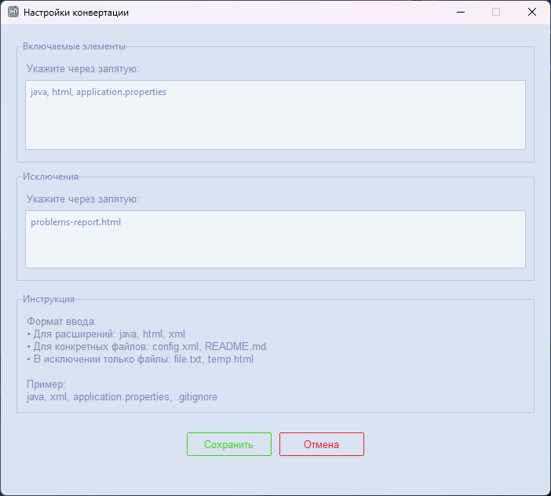

# Скриншоты приложения Code2PDF

## 🖼️ Главное окно приложения

### Основные элементы:

1. **Выбор директории проекта** - укажите папку с исходным кодом
2. **Выходная директория** - выберите, куда сохранять PDF-файлы
3. **Настройки конвертации**:
    - Создание отдельных PDF
    - Генерация объединенного файла
    - Очистка выходной директории
4. **Прогресс выполнения** - визуализация процесса конвертации
5. **Кнопка запуска** - начало процесса конвертации

---

## ⚙️ Окно настроек

### Возможности настроек:

1. **Включаемые элементы**:
    - Расширения файлов (java, html, xml)
    - Конкретные файлы (application.properties, config.xml)
2. **Исключения** - список файлов, которые будут пропущены
3. **Инструкция** - подробное описание формата ввода
4. **Управление**:
    - Сохранение настроек
    - Отмена изменений

---

## 🎨 Особенности интерфейса

- Современный дизайн на основе ttkbootstrap
- Интуитивная навигация
- Подробные подсказки и инструкции